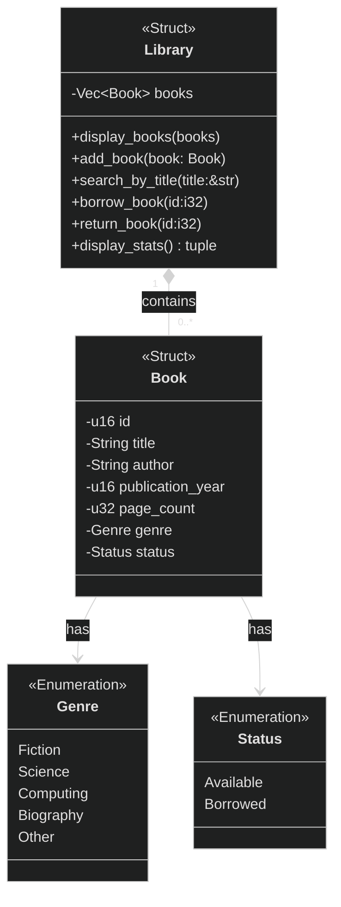
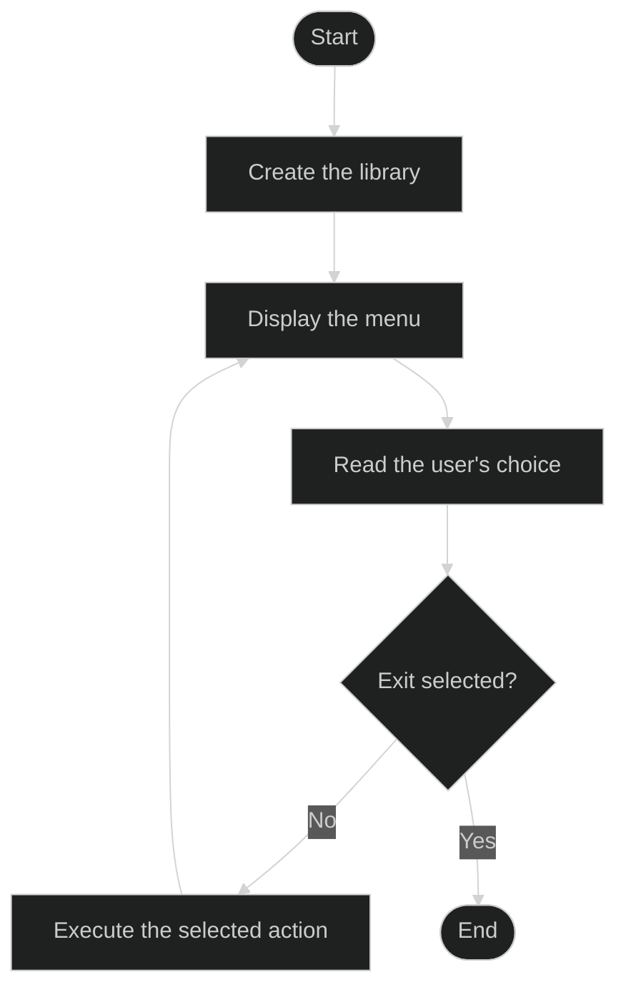

# TP1 - Rust fondamental - Library Manager

## Functionalities
1. Display main menu
   > User must choose an option. The menu repeat until the user choose to quit.
2. Display all books
    > Must clearly display all books in collection. If there is no books, display a message that there is no book.
3. Add a book
    > User must be able to add a book into the library. A book must contain minimally: title, author, year, number of pages, genre and status.
4. Search a book by title
    > User must be able to search if there is a book in the collection with the title of a part of the title. If no title found, display a clear message
5. Modify the status of a book
    > User enter the id of a book to borrow or return a book. Must check if available of not depending on the situation.
6. Display stats
    > Display some stats like total books, total page number, mean pages, number of book available and not. At least a part of the stats must be return as a tuple.  
7. Exit properly
    > User should be able to exit within the menu. Must display a clear message that the program has ended. 

## Class diagram

## Program Flow

---
# Difficulties
One important difficulty in this project was deciding how to transfer the data collected in the menu prompts to the library logic when creating a new book.

At first, I was not sure if `prompt_book()` should directly create and return a `Book`, or if it should only return raw user input that would later be transformed into a `Book` inside `Library`.

This created a design problem with visibility and responsibilities:
- if `prompt_book()` returns a `Book`, then the constructor must be accessible from outside the `library` module;
- if the constructor stays private, then I need an intermediate structure to carry the data from the menu to the library;
- I also wanted to avoid passing too many separate parameters between functions.

For now, I decided to make the constructor public in order to keep the project simpler and easier to continue. This solution is less strict in terms of encapsulation, but it makes the flow easier to understand:
- the menu collects the information;
- a `Book` can be created directly from that input;
- the `Library` remains responsible for storing books in its collection with `push`.

Later, a possible improvement would be to keep the constructor private and introduce a command or input structure dedicated to book creation.
