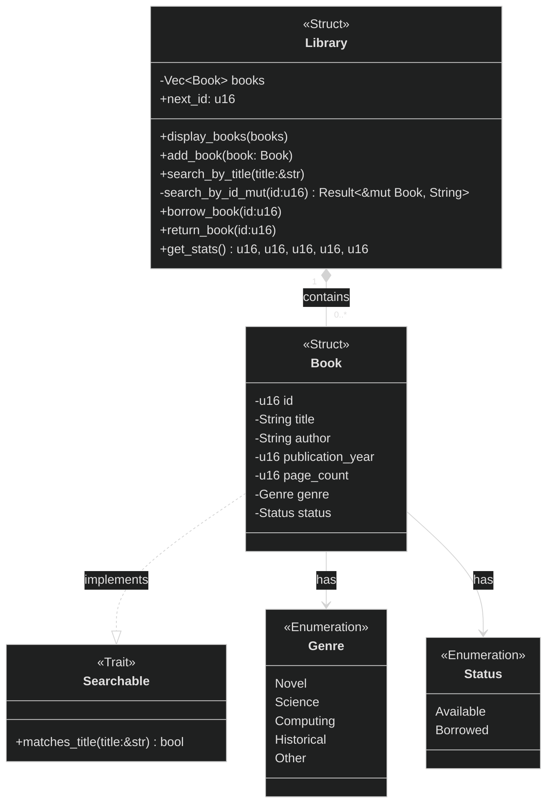

# TP1 - Rust fondamental - Library Manager

## Project Goal
This project is a command-line library manager built in Rust for a fundamental programming assignment. The goal was to practice structs, enums, traits, ownership, borrowing, error handling and modular design.

---

## Functionalities
1. Display main menu
   > User must choose an option. The menu repeat until the user choose to quit.
2. Display all books
    > Must clearly display all books in collection. If there is no books, display a message that there is no book.
3. Add a book
    > User must be able to add a book into the library. A book must contain minimally: title, author, year, number of pages, genre and status.
4. Search a book by title
    > User must be able to search if there is a book in the collection with the title of a part of the title. If no title found, display a clear message
5. Modify the status of a book
    > User enter the id of a book to borrow or return a book. Must check if available of not depending on the situation.
6. Display stats
    > Display some stats like total books, total page number, mean pages, number of book available and not. At least a part of the stats must be return as a tuple.  
7. Exit properly
    > User should be able to exit within the menu. Must display a clear message that the program has ended. 
---


## Technical Concepts Used

- Structs and enums
- Traits
- Pattern matching
- Result-based error handling
- Vector collection management
- Ownership and mutable borrowing
- Module organization

---

## Class diagram

---
## Program Flow


---

## How to run the program
With the command line, navigate to the project folder and run the following command:
````bash
cargo run
````
---

## Useful Rust Commands Learned

During this project, I also learned that Rust provides standard tools to check and improve code quality before submitting a project.

```bash
cargo check
```

Checks if the project compiles without producing the final executable. This is useful for quickly validating the code while developing.

```bash
cargo fmt
```

Formats the code using the official Rust style. This helps keep the project consistent and easier to read.

```bash
cargo clippy
```

Runs Rust's linter and gives suggestions to make the code more idiomatic. It helped me notice small improvements such as removing unnecessary borrows, returning expressions directly and handling division more safely.

These commands are useful because they go beyond simply making the program work. They help improve readability, maintainability and alignment with common Rust practices.

---
# Difficulties
One important difficulty in this project was deciding how to transfer the data collected in the menu prompts to the library logic when creating a new book.

At first, I was not sure if `prompt_book()` should directly create and return a `Book`, or if it should only return raw user input that would later be transformed into a `Book` inside `Library`.

This created a design problem with visibility and responsibilities:
- if `prompt_book()` returns a `Book`, then the constructor must be accessible from outside the `library` module;
- if the constructor stays private, then I need an intermediate structure to carry the data from the menu to the library;
- I also wanted to avoid passing too many separate parameters between functions.

For now, I decided to make the constructor public in order to keep the project simpler and easier to continue. This solution is less strict in terms of encapsulation, but it makes the flow easier to understand:
- the menu collects the information;
- a `Book` can be created directly from that input;
- the `Library` remains responsible for storing books in its collection with `push`.

Later, a possible improvement would be to keep the constructor private and introduce a command or input structure dedicated to book creation.

Also, the memory management of the `Vec<Book>` collection in `Library` was a bit tricky at first, especially when it came to borrowing and returning books. I had to ensure that the status of each book was correctly updated without causing ownership issues or borrowing conflicts in Rust.

---

# Learning Notes


This project helped me connect Rust concepts with my previous experience in PLC programming. Structs and enums felt familiar because I already use similar patterns to model machine states and sequences.

The main new challenge was Rust's ownership and borrowing system, especially when modifying books stored inside a `Vec<Book>`. This forced me to think more carefully about data access, mutability and responsibilities between modules.

I also used RustRover to improve my workflow, especially for formatting, navigation, constructor generation and Markdown preview.

---

## Possible Improvements

- Add unit tests
- Persist books in a file
- Replace some panics with proper error handling
- Use a dedicated input structure for creating books
- Improve validation for user input
- Replace the statistics tuple with a dedicated `LibraryStats` struct in a real project. The tuple was kept here because the assignment required using one, but a struct would make the returned values more explicit and easier to maintain:

```rust
struct LibraryStats {
    total_books: u16,
    total_pages: u16,
    mean_pages: u16,
    available_books: u16,
    borrowed_books: u16,
}
```
