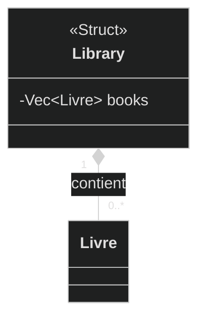
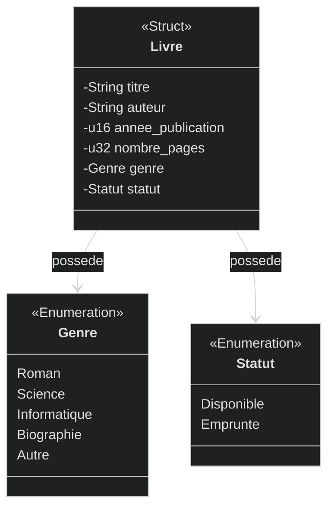
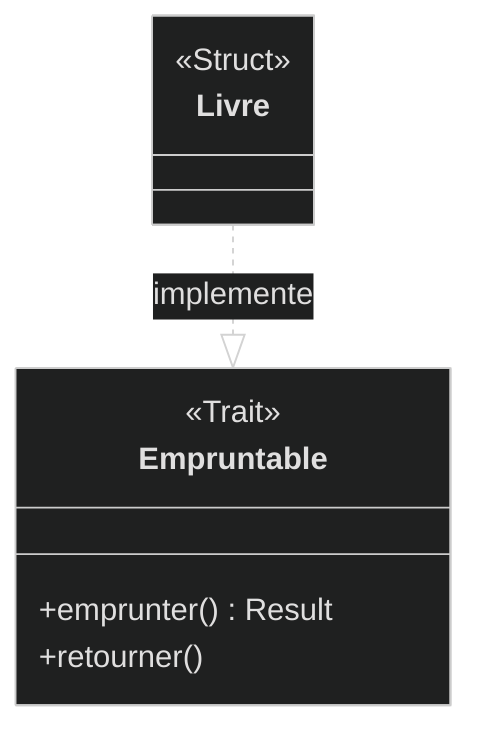

# TP1 - Rust fondamental - Library Manager

## Functionalities
1. Display main menu
2. Display all books
3. Add a book
4. Search a book by title
5. Modifie the status of a book
6. Display stats

## Class diagrams

### Library

### Book

### Trait Rust

Un trait Rust se represente comme une interface avec une relation de
realisation :

